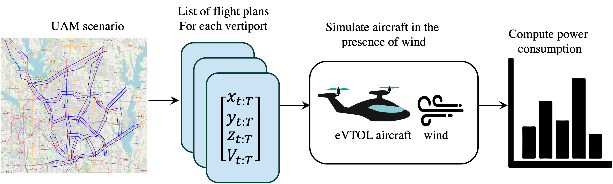

eVTOL Energy Consumption
===================================

   
Overview
--------

The objective of this project is to forecast the daily energy demand at charging stations of Urban Air Mobility (UAM) operations. The method we develop here to forecasting charging demand takes into account key factors influencing energy consumption in UAM, including the aircraft model, wind forecasts, mission flight plans, and flight demands over a specified forecast period.
   

    

Contents
--------
    
Check out the following sections for further infromation about the project, including the :doc:`scenario` from the experiments, and :doc:`usage` for :ref:`installation` of the project.

.. toctree::
   :maxdepth: 2
   
   index
   scenario
   usage

For the full implementation of this project, please visit our `GitHub repository <https://github.com/Abenezergirma/eVTOL-energy-consumption>`_.

.. note::

   This project is under active development.
   
   

