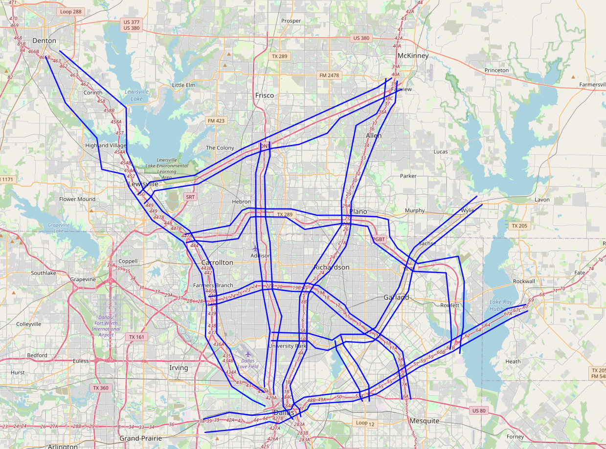

Scenario
=========

The proposed charging demand forecasting scenario was implemented for the Dallas Fort-Worth (DFW) area. The following figure presents a snapshot of this scenario. In the figure, corridors where aircraft are expected to fly between vertiports are shown as blue lines. The scenario includes three vertiports. For the daily flight demand from each vertiport, we modeled as a distribution of three Gaussian curves: :math:`\mathcal{N}(8,2)`, representing commuter rush hour peaks at 8:00 A.M., :math:`\mathcal{N}(16,2)` at 4:00 P.M., and :math:`\mathcal{N}(12,6)`, corresponding to daytime commuter travel demand. 

